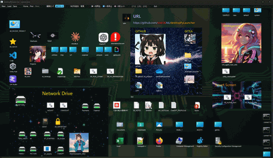

# 🚀 desktopPyLauncher TNG

**desktopPyLauncher TNG** は、Windows 11 専用の高機能デスクトップランチャー＆プロジェクト管理アプリです。 

ショートカット、画像、動画、ノート、ターミナル、プロジェクトファイル等を自由に配置し、プロジェクト単位で統合管理できます。通知システム、複数のターミナル実装、高度な実行制御など、従来のランチャーを超えた包括的なデスクトップ環境を提供します。


---

## 🎯 このアプリの目的

- デスクトップをアイコンで散らかしたくない人に
- ネットワークドライブが固まるから普段はアンマウントしておきたい人に
- 作業プロジェクトごとにツールや資料のショートカット配置を切り替えたい人に (markdown、動画、画像も画面内にそのまま表示できる)
- デスクトップ切り替えアプリを使うほどじゃないんだよなっていう人に（常駐しない）
- Pythonでランチャーアプリを作って自由にカスタマイズでしたい人に（たたき台として）
- 動画を並べて閲覧したい人に（チュートリアル動画やお気に入りの動画を並べて使おう。再生位置をそれぞれ保存できます）
- アイコンにアニメーションGIFを使ってみたい人に

---

## 🛠️ 使用方法と主な機能

### 📁 起動方法・プロジェクトファイル

```bash
# 通常起動 (ファイル指定なしの場合 default.json が読み込まれます)
python desktopPyLauncher.py

# --file オプションでプロジェクトファイル指定
python desktopPyLauncher.py --file ..\myProject\default.json
python desktopPyLauncher.py -f myproject.json

# 後方互換性として位置引数も使用可能
python desktopPyLauncher.py ..\myProject\default.json

# 新しいプロジェクトファイル作成
python desktopPyLauncher.py --create newproject.json

# 言語設定
python desktopPyLauncher.py --lang ja  # 日本語
python desktopPyLauncher.py --lang en  # 英語

# デバッグモード
python desktopPyLauncher.py --debug

# ヘルプ表示
python desktopPyLauncher.py --help

スタートアップに登録して使うと便利です。（インストールのセクション参照）
```

### 🔧 コマンドライン引数

| オプション | 説明 |
|-----------|------|
| `--file`, `-f` | プロジェクトファイル指定 (デフォルト: default.json) |
| `--create` | 新しい空のプロジェクトファイルを作成 |
| `--lang` | UI言語設定 (`ja`: 日本語, `en`: 英語) |
| `--debug` | デバッグ出力を有効化 |
| `--help` | ヘルプメッセージを表示 |

### 📝 プロジェクトファイルについて

- `.json` ファイルは **作業用のプロジェクト定義ファイル** です。
- 指定された `.json` の **あるフォルダが作業ディレクトリ** になり、相対パスも正しく解決されます。
- JSON が存在しない場合は空の新規プロジェクトとして開始できます。

---

### 🧩 アイテムの種類と操作

### 📌 基本操作
- **ドラッグ＆ドロップ**でデスクトップからアイテムを追加
- **編集モード/実行モード**の切り替え（ツールバーまたは中央ボタン）
- **実行モード**: ダブルクリックで実行・オープン
- **編集モード**: ダブルクリックで設定画面
- **範囲選択**: 空白エリアからドラッグで複数選択
- **右クリック**: コンテキストメニュー表示

### 🎯 アイテム種類

#### 💻 ランチャーアイテム（実行可能）
- **対応形式**：.exe, .com, .jar, .msi, .bat, .cmd, .ps1, .py, .js, .vbs, .wsf
- **ショートカット対応**：.lnk, .url ファイルの解析・実行
- **設定オプション**：
  - 🛡️ **管理者として実行**（UAC プロンプト経由）
  - ✏️ **編集で開く**（関連付けエディタで開く）
  - 👁️ **非表示で実行**（バッチファイル用・コマンドプロンプト非表示）
  - 📁 **作業ディレクトリ指定**
  - 🎨 **カスタムアイコン設定**（ファイル指定またはBase64埋め込み）
- **ターミナル連携**：最寄りのターミナルアイテムでスクリプト実行可能
#### 🖼️ 画像アイテム
- **対応形式**：.png, .jpg, .jpeg, .bmp, .ico
- **機能**：
  - 📐 **リサイズ・クロップ**（アスペクト比維持）
  - ✨ **明度調整**（0-100%）
  - 💾 **Base64埋め込み保存**（プロジェクトに内包）
  - 🎨 **高品質スケーリング**（段階的縮小アルゴリズム）
  - 📋 **クリップボード対応**（画像の貼り付け）

#### 🎬 アニメーションGIF
- **専用アイテム**：.gif ファイル用
- **機能**：
  - ▶️ **クリックで再生/停止制御**
  - 📐 **リサイズ・明度調整**
  - 💾 **Base64埋め込み対応**

#### 🎥 動画アイテム
- **対応形式**：.mp4, .mov, .avi, .mkv, .webm, .wmv
- **機能**：
  - ▶️ **再生・停止・ミュート**
  - 🔖 **ジャンプポイント設定**（最大3箇所）
  - 🎛️ **複数動画の一括制御**
  - 💾 **再生位置記憶**（プロジェクト保存時）
  - ⚠️ **注意**：動画ファイル実体の保持が必要（埋め込み非対応）

#### 📝 ノートアイテム
- **表示モード**：プレーンテキスト / Markdown 切り替え
- **機能**：
  - 🎨 **背景・テキスト色設定**
  - 📖 **動作モード**：WALK（移動）/ SCROLL（スクロール）/ EDIT（編集）
  - 📁 **外部ファイル読み込み**対応
  - 🔄 **リアルタイム Markdown レンダリング**

#### 🗂️ プロジェクトファイル（JSON）
- **機能**：他のdesktopPyLauncherプロジェクトへの切り替え
- **判定基準**：`fileinfo` セクション有無
- **編集対応**：通常のJSONファイルは編集モードで開く可能

#### 💻 ターミナル・コマンド実行
- **XtermTerminalItem**：xterm.js ベースの本格端末エミュレーター
  - PTY サポート（winpty 使用）
  - ANSI エスケープシーケンス完全対応
  - 双方向通信・対話型プログラム対応
- **InteractiveTerminalItem**：QProcess ベース双方向端末
- **TerminalItem**：シンプル端末（直接入力）
- **CommandWidget**：コマンド実行ウィジェット
  - 対応シェル：cmd, PowerShell, PowerShell Core, WSL, Git Bash
  - カスタムコマンド対応

#### 🎨 図形・マーカー系
- **MarkerItem**：キャンバス上のマーカー（ジャンプ機能付き）
- **GroupItem**：複数アイテムのグループ化
- **RectItem**：矩形描画（色・枠線・角丸設定）
- **ArrowItem**：矢印描画（角度・色設定）

#### 📎 汎用ファイルアイテム
- **対応**：上記以外のすべてのファイル
- **動作**：OS の関連付けアプリで開く

---

### 🎨 キャンバス操作
ツールバーの編集モード/実行モードによって切り替えます。
なお、マウスの中央のボタンでも編集/実行モードが切り替えられます。
それぞれに機能は下記のとおりです。

**実行モード**
- フォルダアイコン を ダブルクリック -> エクスプローラーで開く
- プロジェクトアイコン を ダブルクリック -> プロジェクト画面切り替え
- 画像 を ダブルクリック -> 既定の画像ビューアー起動
- ノートは、アクティブにしてクリックすると、ドラッグ操作・ホイール操作の挙動が変わります。ノートのスクロールか全体のスクロールかの切り替えができます。
- ビデオアイテムは、再生ボタンが各アイテムについています。
  - 画面上に複数の動画を配置し、任意の区間を一括で連続再生できます。(3区間のみ)

**編集モード**
- アイテムはドラッグで自由に移動
- 右下の「グリップ」でサイズ調整
- アイテムの削除は右クリックのコンテキストメニューからできます
- 右クリックのコンテキストメニューから、メディア（アイコン・画像・動画）のサイズににフィットできます。
- 何もない空間からドラッグ開始で**範囲選択** → 複数アイテムを一括移動可能
- ダブルクリックで各アイテムの詳細設定
- マーカーは、マーカー同士でリンクできます。ダブルクリックで移動できます。非表示にすればマーカーのキャプションは不可視になります。
- グループ化は、マーカーにアイテムを結び付ける機能です。
  マーカーを最背面にしその上にアイコンを描画する形になります。
  マーカーを移動するとアイコンも一緒に移動します。
  グループ化解除、または、そのマーカーを削除するとグループ化が解除されます。
  （このマーカーを削除するだけでグループ化は解消します。その他の依存関係ありません。クリーンです。）

- エクスポート
  現在表示中のプロジェクトを、おおよその見た目を保ったままHTMLにエクスポートできます。実験中の機能です。
  ナレッジの共有などの便利です。

---

### ✂️ コピー・ペースト機能（画像も対応）

- 選択してコピーしたアイテムは **JSONテキスト** としてクリップボードに保存されます。
- ペースト時には元のアイテム構造がそのまま復元されます。（プロジェクト間でアイコンを移動したい時などに利用できます）
- 複数アイテムの **相対位置も保持** されるので、複製や他プロジェクトへの転送に便利です
- 画像をクリップボードからペーストすることもできます
- 各アイテムの編集画面のアイコンにも画像をペーストできるのでスムーズに画面を構成できます。

---

### 🔁 履歴ナビゲーション

- 過去に開いたプロジェクトファイルを記録し、`HOME / PREV / NEXT` ボタンで切り替え可能
- ※VideoItem を含むプロジェクトで **連続切替を高速で行うと固まることがあります**
- 戻るボタンで PREV をクリックできます（前のプロジェクト）
- 進むボタンで NEXT をクリックできます（次のプロジェクト)


---
## 🔍 機能詳細

### 🚨 **新機能：通知システム**
- **ニュースティッカー風通知**：画面上部に表示される通知バー
- **通知タイプ**：成功（緑）、情報（青）、警告（橙）、エラー（赤）
- **自動表示**：LauncherItem実行時、保存時、エクスポート時
- **アニメーション**：フェードイン・アウト効果付き

### 🎛️ **高度な実行制御**
- **管理者権限実行**：UAC プロンプト経由での権限昇格
- **非表示実行**：バッチファイル用、コマンドプロンプト非表示
- **表示実行**：OS標準機能でコマンドプロンプト表示
- **ターミナル連携実行**：最寄りのターミナルアイテムでスクリプト実行
- **作業ディレクトリ指定**：実行時のカレントディレクトリ設定

### 🖥️ **ターミナル統合機能**
- **複数のターミナル実装**：用途に応じて選択可能
  - 📱 **シンプル端末**：基本的なコマンド実行
  - 🔄 **双方向端末**：対話型プログラム対応
  - 💻 **本格端末**：xterm.js使用、完全なPTYサポート
- **多様なシェル対応**：cmd, PowerShell, WSL, Git Bash等
- **ANSI色対応**：カラフルな出力表示
- **カスタムコマンド**：よく使うコマンドの登録・実行

### 🎨 **画像・動画システム v1.1**
- **新しい埋め込みシステム**：
  - `image_embedded`: 埋め込みフラグ
  - `image_embedded_data`: Base64データ
  - `image_format`: 自動フォーマット検出
- **高品質スケーリング**：段階的縮小で品質劣化を最小限に
- **LOD対応**：ズームレベルに応じた動的品質調整
- **動画再生位置記憶**：プロジェクト保存時に再生位置を記録

### 🔧 **UI・操作性の向上**
- **ミニマップ機能**：キャンバス全体の俯瞰とナビゲーション
- **履歴ナビゲーション**：プロジェクト間の前進・後退
- **5ボタンマウス対応**：サイドボタンで戻る・進む
- **スナップ機能**：他アイテムへの位置・サイズ吸着
- **範囲選択**：複数アイテムの一括操作

### 💾 **データ管理・エクスポート**
- **バージョン管理**：v1.0→v1.1の自動移行
- **HTMLエクスポート**：Webブラウザで表示可能な形式
- **テンプレートシステム**：エクスポート形式のカスタマイズ
- **プロジェクト履歴**：最近使ったプロジェクトの記録

### 📋 **コピー＆ペースト機能**
- **JSON形式**：アイテム情報の完全保持
- **相対位置保持**：複数アイテムの配置関係維持
- **画像ペースト**：クリップボードからの直接貼り付け
- **プロジェクト間移動**：異なるプロジェクト間でのアイテム移動

### 🎬 **マルチメディア活用**
- **チュートリアル管理**：動画・画像・説明ノートを一画面に配置
- **プレゼン資料**：関連画像・動画・実行デモを統合表示
- **学習環境**：参考動画、コード、ノート、実行環境を一元管理

---

## 📦 インストール

> 💻 本アプリは **Windows 11 専用** です（macOS / Linux 非対応）。

```bash
git clone https://github.com/yourname/desktopPyLauncher.git
cd desktopPyLauncher
pip install -r requirements.txt
```

### 必須ライブラリ

- **PySide6** — GUI全体、動画・SVG描画、Web Engine（xterm.js端末）に使用
- **markdown** — NoteアイテムのMarkdown表示に使用
- **pywin32** — `.lnk` ショートカット解析に必要（未導入だと `.lnk` は読み取れません）
- **winpty**（オプション） — XtermTerminalItemのPTYサポートに使用（本格端末機能）

### システム要件

- **Windows 11 専用**（macOS / Linux 非対応）
- **Python 3.8+** 推奨
- **.NET Framework 4.7.2+**（PowerShell関連機能用）
- **winpty**（xterm.js端末使用時）

---

## 📌 スタートメニューにピン留めする方法（Windows 11）

Windowsでは `.py` を直接ピン留めできないため、以下の手順で `.bat` 経由のショートカットを作成します。

1. `desktopPyLauncher.py` と同じフォルダに `.bat` ファイルを作成（例：`launch_launcher.bat`）：

    ```bat
    @echo off
    python "%~dp0desktopPyLauncher.py"
    ```

	プロジェクトファイル指定したい場合
    ```bat
    @echo off
    python "%~dp0desktopPyLauncher.py" --file ..\myData\myProject.json
    ```

	または位置引数でも可能（後方互換性）
    ```bat
    @echo off
    python "%~dp0desktopPyLauncher.py" ..\myData\myProject.json
    ```
	
2. `.bat` ファイルのショートカットを作成

3. ショートカットの「リンク先」を次のように修正：

    ```
    cmd /c "C:\Path\To\launch_launcher.bat"
    ```

    ※パス全体を `" "` で囲んでください。cmd.exeは保存後パスがc:\～から補完されますがそれで大丈夫です。

4. ショートカットを右クリック →「スタートメニューにピン留め」

5. 一度起動後、タスクバーアイコンを右クリック →「タスクバーにもピン留め可能」

---

## 📝 技術仕様・制限事項

### ⚙️ **基本仕様**
- **アイテム追加**：主にドラッグ＆ドロップで実行
- **メニュー追加**：NEW（プロジェクトファイル）とNOTE のみ
- **編集フロー**：ドラッグ＆ドロップ → 編集モード → 実行モードに切り替え
- **プロジェクトファイル**：JSON形式、`fileinfo` セクションで判定
- **アイテムタイプ固定**：GIF⇔画像、ランチャー⇔プロジェクトの相互変換不可

### 🔒 **実行権限・セキュリティ**
- **管理者権限実行**：PowerShell + Start-Process -Verb RunAs 使用
- **編集で開く**：ShellExecute の "edit" 動詞使用（OS依存）
- **非表示実行**：QProcess または vbs 経由でコマンドプロンプト非表示

### 🎬 **動画システム制限**
- **描画方式**：コンテナ + オーバーレイ方式（Qt6 + Win32的実装）
- **安定性考慮**：VideoItem は環境依存性が高い
- **描画制限**：動画領域との重複でクラッシュの可能性
- **非同期処理**：asyncio による安定化は見送り（現在の実装で安定動作）

### 🖱️ **UI制限**
- **右クリックメニュー**：キャンバス上で右クリック実行される場合あり（既知の仕様）
- **高速切替**：VideoItem を含むプロジェクトでの高速切替時にフリーズの可能性

### 🏗️ **アーキテクチャ情報**
- **開発手法**：要件定義 → AI実装 → 人間によるリファクタリング・調整
- **モジュール設計**：機能別モジュール分割（DPyL_*.py）
- **自動登録**：アイテムクラスの動的検出・登録システム
- **バージョン管理**：JSON構造のマイグレーション対応

## 💡 活用事例・TIPS

### 🐍 Python開発者向け

#### 💻 **ターミナル環境の使い分け**
- **TerminalItem**（基本）：シンプルなコマンド実行
  - 用途：pip install、git status等の単発コマンド
  - 特徴：軽量、素早い起動、基本的なコマンド実行
- **InteractiveTerminalItem**（双方向）：対話型プログラム対応
  - 用途：python -i スクリプト.py、IPython、デバッガー対話
  - 特徴：ANSI色対応、リアルタイム入出力、プロセス間通信
- **XtermTerminalItem**（本格）：完全な端末エミュレーター
  - 用途：vim編集、tmux/screen、SSH接続、複雑なCLIツール
  - 特徴：xterm.js + PTY、完全なANSIエスケープシーケンス、本物の端末環境
- **CommandWidget**：定型コマンドのワンクリック実行
  - 用途：よく使うコマンドの登録（pytest、black、flake8等）
  - 特徴：シェル選択可能（cmd/PowerShell/WSL）、カスタムコマンド登録
  
(ターミナル作ろうと思うと大体この流れになるんですよ・・・。あえてすべての実装して残しておきます。
現状、プロジェクト内に配置することにより出力を受け取れるのは冒頭の TerminalItem のみです。)

## 💡 TIPS

### 🌐 ネットワークドライブ運用TIPS
Windowsではネットワークドライブをマウントしたままにしておくとネットワーク接続の問題でOSが固まる場合があります。
必要な時のみマウント/アンマウントを行う運用が推奨されます。

- **マウント用バッチファイル**（mount_drives.bat）：
  ```batch
  @echo off
  echo chcp 65001
  net use X: \\server\share1
  net use Y: \\server\share2
  echo ネットワークドライブをマウントしました
  timeout /t 2
  ```

- **アンマウント用バッチファイル**（unmount_drives.bat）：
  ```batch
  @echo off
  echo chcp 65001
  net use X: /delete /y
  net use Y: /delete /y
  echo ネットワークドライブをアンマウントしました
  timeout /t 2
  ```

これらのバッチファイルをランチャーアイテムとして登録することで、ワンクリックでマウント/アンマウントが可能になります。

### 🖥️ コンソールウィンドウ非表示起動
Python製アプリケーションのため、通常起動時にコマンドプロンプトが表示されます。
デスクトップランチャーとして使用する際は、このコンソールウィンドウを非表示にする方法が便利です。

- **VBSスクリプトによる非表示起動**：
  ```vbs
  ' start_launcher.vbs - コマンドプロンプト非表示起動
  Set WshShell = CreateObject("WScript.Shell")
  WshShell.Run """desktopPyLauncher.bat""", 0, False
  ```
- **スタートメニュー登録手順**：上記VBSファイルを実行するショートカットを作成
- **使用場面**：常駐使用、プレゼンテーション時、クリーンなデスクトップ環境構築時

### 🔮 将来構想・拡張性
- **Web API連携**：curlコマンド等でHTTP通信（現状でも可能）
- **IoT統合**：デバイス制御コマンドの統合実行環境
- **埋め込みファイル管理**：アイコン・画像はBase64埋め込み対応（動画は実体ファイル必要）
- **ネットワーク耐性**：ネットワークドライブ未接続でもフリーズしない設計

## 🚧 開発方針・開発予定・メモ
- **ファイル一覧表示**：フォルダ内ファイルのグリッド表示
- **ウィジェット機能**：リアルタイム情報表示（CPU使用率、メモリ、天気等）
- **サムネイラー機能**：画像・動画・文書のプレビュー表示
- **テーマシステム**：ダーク/ライトモード、カスタムテーマ (一応実装はしてある。テストしてない)
- **多言語対応**：現在は日本語専用 (これも一応実装はしてある。テストしてない)
- **ファイル操作機能**：コピー・移動・削除・リネーム
- **AI連携機能**：テキスト生成、コード補完、自動分類
- **クラウド連携**：OneDrive、GoogleDrive等との同期 (基本やりたくない)
- **パフォーマンス最適化**：大量アイテム時の描画速度向上
- **メモリ使用量削減**：動画・画像の効率的なメモリ管理
- **安定性向上**：VideoItemの描画系統の改良

## 🌸 About This Japanese Project

### Why Japanese?

This project is intentionally developed in Japanese by a Japanese developer who has over 20 years of experience managing international projects in English, yet chose to return to their native language for this endeavor.

### 🔄 **Return from English to Japanese**

Through years of international project experience, we discovered several insights:

- **Requirements Precision**: Complex software requirements are far more accurately conceived in one's native language
- **Depth of Thought**: Japanese thinking allows for deeper, more nuanced understanding than English thinking for this developer
- **Development Efficiency**: Native language development dramatically improves the speed from conceptualization to implementation

### 🤖 **AI-Era Development Methodology**

In modern AI-assisted development, fascinating phenomena occur:

- **AI Language Adaptation**: When you speak to AI in Japanese, it naturally generates comments in Japanese
- **Translation Abandonment**: Stopping English translation work resulted in more comprehensible code than English versions
- **Comment Quality**: Japanese comments more accurately express actual processing content

### 🌍 **Internationalization Strategy**

- **AI-Assisted i18n**: With current AI technology, internationalization (i18n) can be easily implemented later
- **Development Status**: This project is currently under active development
- **Future Expansion**: English and other language versions will be considered based on demand

### 💭 **Development Philosophy**

This project adopts a contrarian approach: "First perfect it in your native language, then expand to the world." This is also an attempt to rediscover the value of native languages in the era of globalization.

**Conclusion**: Better software is born in the language where developers can think most deeply.

---

## 🙏 Credits and Acknowledgments

This project uses the following third-party libraries and software. We thank all the developers and contributors who have made these projects available.

### Core Libraries

#### **PySide6**
- **License**: LGPL v3 or Commercial License
- **Copyright**: © 2023 The Qt Company Ltd.
- **Website**: https://www.qt.io/qt-for-python
- **Usage**: Primary GUI framework for the entire application

#### **Python-Markdown**
- **License**: BSD License
- **Copyright**: © 2007-2023 The Python Markdown Project
- **Website**: https://python-markdown.github.io/
- **Usage**: Converting Markdown text to HTML in DPyL_note.py

#### **pywin32**
- **License**: Python Software Foundation License
- **Copyright**: © Mark Hammond and contributors
- **Website**: https://github.com/mhammond/pywin32
- **Usage**: Windows COM interface for shell operations in DPyL_classes.py

### Image and Media Processing

#### **Pillow (PIL Fork)**
- **License**: Historical Permission Notice and Disclaimer (PIL License)
- **Copyright**: © 1997-2011 by Secret Labs AB, © 1995-2011 by Fredrik Lundh, © 2010-2024 by Jeffrey A. Clark and contributors
- **Website**: https://python-pillow.org/
- **Usage**: Image processing and format detection in DPyL_utils.py

### Optional Dependencies

#### **winpty**
- **License**: MIT License
- **Copyright**: © 2011-2016 Ryan Prichard
- **Website**: https://github.com/rprichard/winpty
- **Usage**: Windows pseudo-terminal support in terminal components (optional dependency)

#### **xterm.js**
- **License**: MIT License
- **Website**: https://xtermjs.org/
- **Usage**: Full-featured terminal emulation in XtermTerminalItem

### Python Standard Library
This project also uses various modules from the Python Standard Library, which is licensed under the Python Software Foundation License.

### Acknowledgments
We acknowledge and thank all the contributors to these open source projects. Their work has made this application possible.

---

## 📝 ライセンス

MIT License

---

Happy launching! 🐾
